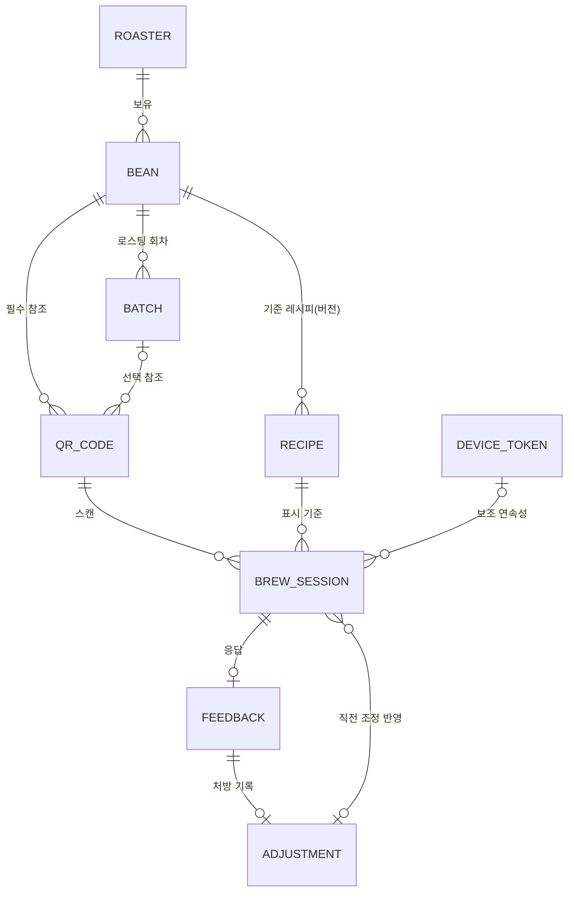

# PRD: AI Coffee Dial-in Assistant — v0.3 (draft)

> 상태: 초안. 지금까지 함께 결정한 것만 채웠고, 아직 안 정한 부분은 `[미결정]`으로 비워두었다.
> `[미결정]` 칸이 다음에 결정할 자리다. 채워진 칸도 확정이 아니라 검증 대상이다.
> 작성 기준일: 2026-06-11 (v0.2: 2026-06-10 / v0.1: 2026-06-05)

## v0.2 → v0.3 변경 요약

1. **§8 데이터 모델 v0 신설**: 9개 엔티티·관계·키 정책 정의. 조정 이력 엔티티를 §6-3 수렴 메커니즘의 전제로 모델에 반영. 레시피는 불변 버전으로 저장해 피드백 데이터의 기준 레시피를 보존.
2. **QR 발급 단위 결정** (§8-3): v0.2의 "원두 vs 원두×배치" 질문을 인쇄 단위와 참조 단위로 분리. 인쇄 단위는 봉지 단위 유니크 발급으로 확정(§6-3 수렴 전제 → §3 연속성 1안 → 발급 단위의 논리 사슬), 참조 단위는 원두 필수·배치 선택.
3. **데이터 격리 정책 결정** (§8-4, 부록 10): 전 엔티티 테넌트 키 적용, 디바이스 토큰 로스터별 분리 발급.
4. **§2 측정 지표 확정(잠정 기준 포함)**: 조정 후 만족도 상승률로 택1, 성공/실패 숫자 기준은 잠정값. 재추출 확인 방법은 봉지 QR 재스캔(+디바이스 토큰 보조)으로 결정.
5. **세션 사슬 정의 신설** (§8-5): §2 측정과 §6-3 반전 감지가 공유하는 연속성 규칙.

---

## 1. 문제 정의

스페셜티 로스터의 고객은 같은 원두를 받아도 자기 장비·환경에서 추천 레시피대로 맛이 안 나오는 경우가 많다. 그 결과 "원두가 별로다"라는 오해, CS 문의, 재구매 이탈이 발생한다. 로스터는 어떤 고객이 어떤 원두에서 어떤 문제를 겪는지 알 길이 없다.

이 제품은 고객의 맛 피드백을 받아 다음 레시피를 조정해주고, 그 과정에서 쌓이는 원두-레시피-피드백 데이터를 로스터에게 돌려준다.

## 2. 핵심 가설 (이게 거짓이면 나머지는 무의미)

> 피드백 한 번이 실제로 다음 잔을 더 낫게 만든다.

- 측정 지표 (v0.3 결정): **조정 후 만족도 상승률** — 조정 처방이 나간 세션의 사슬(§8-5)에서 후속 세션이 관측됐을 때, 후속 세션의 만족도가 직전보다 한 단계 이상 오른 비율.
- 성공/실패 기준 (잠정): 상승률 60% 이상이면 가설 유지, 40% 미만이면 조정 규칙 전반 재검토, 그 사이면 칸 단위 점검(어느 칸의 처방이 깨지는지). 숫자는 파일럿 데이터를 보기 전의 잠정값이다.
- 재추출 확인 방법 (v0.3 결정): 봉지 단위 유니크 QR 재스캔(1순위) + 디바이스 토큰(보조) — §8-5.
- 보조 관찰 지표 (기준 없이 관찰만):
  - 사슬이 3회 세션 안에 "좋아요"에 도달하는 비율 — §6-3 수렴 검증용.
  - 조정 후 재추출 관측률(처방이 나간 뒤 후속 세션이 잡히는 비율) — 측정 가능성 자체를 잰다. 이 값이 너무 낮으면 위 지표의 분모가 부족해진다.

## 3. 대상 사용자

- 1차 고객(파일럿): 스페셜티 로스터 1~2곳. 제조사는 후순위.
- 최종 사용자: 그 로스터의 원두를 사는 홈카페 유저.

### 사용자 인증 (v0.2 결정)

- **계정 기반 "내 이전 피드백 잇기"는 MVP에서 제외.** 로그인·회원가입 없음.
- 대신 **디바이스 단위 익명 연속성**(브라우저 localStorage에 익명 토큰)을 선택 포함:
  - 같은 기기·브라우저로 재접속 시 이전 세션과 자동 연결 → 핵심 가설의 "다시 내렸는지 확인"에도 활용.
  - 한계: 브라우저 변경·캐시 삭제 시 유실. 파일럿 규모에서는 감수.
- 계정/매직링크 기반 잇기: v2 이후.
- 세션 연속성의 위상(v0.2): 반전 감지·감쇠(§6-3 수렴 조건)를 도입하려면 연속성이 전제조건이 됨. 인앱 브라우저 저장소 분리·사파리 ITP 7일 규칙 때문에 localStorage 단독은 신뢰도 낮음.
- (v0.3 확정) 연속성 1순위는 봉지 단위 유니크 QR, 디바이스 토큰은 보조 수단. 발급 단위 결정은 §8-3, 사슬 규칙은 §8-5.

## 3-1. 멀티 테넌트 구조 (v0.2 신설)

QR을 찍으면 **그 원두를 판매한 로스터리가 제공하는 페이지**가 열린다. 사용자 입장에서는 로스터리의 서비스로 보인다.

- 사용자 페이지 구성(예상): 텍스트 형태의 추천 레시피 + 피드백 버튼 몇 개.
- 따라서 로스터리별로 분리되어야 하는 것:
  - 로스터 계정/인증
  - 레시피 등록·관리
  - QR 생성 — 봉지 단위 유니크 발급 (v0.3 결정, §8-3)
  - 수집 데이터 격리 (로스터 A의 데이터는 A에게만) — 정책은 §8-4 (v0.3 결정)
- 브랜딩(로고·색상 등) 커스터마이징 수준: `[미결정]` — 파일럿은 로스터명 표기 정도로 최소화 후보.

## 4. 범위 (v1)

### 포함

- QR 접속 → 해당 로스터의 추천 레시피 표시 (멀티 테넌트, §3-1)
- 만족도 3단계 → 추출시간 사전필터 → (이탈 시) 물온도 분기 트리(§6-2) / (정상 시) 맛·농도 3지선다 → 9칸 매핑 → 규칙 기반 조정
- 챗봇 폴백 (격자로 안 잡히는 케이스)
- 로스터의 레시피 등록 + QR 생성 (봉지 단위 유니크, §8-3)
- 조정 이력 저장 (§8-1 — §6-3 수렴 메커니즘의 전제)
- (선택) 디바이스 단위 익명 연속성 (§3)

### 명시적 제외

- AI 레시피 자동 생성 (데이터 쌓인 뒤 v2)
- 대시보드 UI (파일럿은 주간 요약 이메일/노션으로 대체)
- 자동 데이터 수집 (수동 등록으로 시작)
- 계정 기반 사용자 인증·피드백 잇기 (v2)
- 침출/가압식 장비(에어로프레스, 하리오 스위치 등) 지원 (v2 후보, §4-1)
- 추가 제외 항목: `[미결정]`

### 4-1. 장비 범위 (v0.2 결정)

- **로스터가 등록하는 추천 레시피에 장비 정보가 포함된다.** (예: V60 02, 칼리타웨이브 185)
- 1차 지원: **중력(여과) 추출 방식 — V60, 칼리타 등.** 기존 흐름 설계(추출시간 우선 분기)를 그대로 적용.
- 침출/가압식(에어로프레스, 하리오 스위치 등)은 질문 자체가 달라진다(교반 강도·횟수, 침출 시간 등) → **v1 제외**, 별도 질문 세트 설계 후 v2에서 검토.
- 붓기 프로토콜 고정 여부(4:6 등): `[미결정]` — 고정 시 사용자 조정 변수가 분쇄도·물온도·비율·총량으로 좁혀짐

## 5. 사용자 흐름 (최종 사용자)

1. QR 접속 → 해당 로스터의 추천 레시피 표시
2. "맛은 어땠나요?" → 아쉬워요 / 괜찮아요 / 좋아요
   - 좋아요 → 레시피 유지, 종료
3. (아쉬워요) 추출시간 사전필터: 추천 대비 길었다 / 짧았다 / 비슷
   - **길었다/짧았다 → 물온도 분기 트리(§6-2)로 진입, 조정 제안 후 종료** (v0.2 변경: 기존 "시간 재안내 후 종료"를 대체)
4. (시간 정상 범위) 맛 3지선다: 신 쪽 / 균형 / 쓴 쪽 (+ "해당 없음")
5. 농도 3지선다: 진함 / 적당 / 묽음 (+ "해당 없음")
6. 두 답을 9칸 격자에 매핑 → 규칙 기반 조정 제안 + 다음 레시피 저장
7. "해당 없음"이 섞였거나 사용자가 마지막 출구를 누르면 → 챗봇 폴백
   - 챗봇 입력: 맛 답 + 농도 답 + (실제 추출시간, 나머지 조건, 자유 서술)

> 결정 완료: 입력은 3×3 격자를 노출하는 대신 3지선다 2회로 받아 뒤에서 매핑한다. "예상 결과 한 줄 → 이게 맞나요?" 확인 단계는 제거하되, 챗봇 탈출구는 마지막 한 곳에 둔다. 각 질문의 "해당 없음"은 즉시 탈출이 아니라 선택지로 두어 억지 응답을 막는다.

## 6. 피드백 → 조정 규칙

### 6-1. 추출 컨트롤 격자 (추출시간 정상 범위)

가로축 = 추출 수율(신↔쓴), 세로축 = 농도(진↔묽). 9칸. 가운데 = 목표(유지).

| 칸 | 진단 | 조정 |
|---|---|---|
| 신 + 진함 | 저추출 + 과농도 | 분쇄 곱게 + 물 늘리기 |
| 균형 + 진함 | 적정 + 과농도 | 물 비율만 늘리기 |
| 쓴 + 진함 | 과추출 + 과농도 | 분쇄 굵게 + 물 늘리기 |
| 신 + 적당 | 저추출 | 분쇄 곱게 / 물온도↑ |
| 균형 + 적당 | 목표 | 유지 |
| 쓴 + 적당 | 과추출 | 분쇄 굵게 / 물온도↓ |
| 신 + 묽음 | 저추출 + 저농도 | 분쇄 곱게 + 물 줄이기 |
| 균형 + 묽음 | 적정 + 저농도 | 물 비율만 줄이기 |
| 쓴 + 묽음 | 과추출 + 저농도 | 분쇄 굵게 + 물 줄이기 |

규칙:
- 변(단일 변수) 칸은 한 번에 한 변수, 모서리 칸만 복합 조정.
- 조정 *폭*(분쇄 몇 클릭, 물온도 몇 도): `[미결정]` — 로스터가 원두별 설정 vs 보수적 고정값 후 "아니오" 로그로 보정.

### 6-2. 추출시간 이탈 시 물온도 분기 트리 (v0.2 신설)

추출시간이 추천 대비 "길었다/짧았다"인 경우, 종료하지 않고 한 번 더 묻는다:

> "매장 제공 레시피 기준 물 온도보다 많이 높거나 낮았나요?" — 높음 / 낮음 / 매장 레시피와 비슷 / 잘 모르겠다

| 물온도 (레시피 대비) | 시간 짧았다 | 시간 길었다 |
|---|---|---|
| **높음** | 물온도 낮춰서 다시 → 종료 | 분쇄 약간 굵게 → 종료 |
| **낮음** | 추가 질문 "신 맛이 났나요?" (강/약) 강: 분쇄 조금 곱게 → 종료 약: 분쇄 조금 곱게 + 물온도 조금 높임 → 종료 | 추가 질문 "쓴 맛이 났나요?" (강/약) 강: 분쇄 약간 굵게 → 종료 (v0.2 수정: 과추출 주범인 추출시간을 분쇄도로 잡는다) 약: 분쇄 약간 굵게 → 종료 `[검토: 강/약 처방이 같아져 질문의 변별력 상실 — 부록 11]` |
| **비슷** | 분쇄 조금 곱게 → 종료 | 분쇄 조금 굵게 → 종료 |
| **잘 모르겠다** | 분쇄 조금 곱게 → 종료 | 분쇄 조금 굵게 → 종료 |

규칙·메모:
- 이 트리는 최대 2질문(온도 + 맛 1개) 안에 끝난다. 격자(6-1)로는 진입하지 않는다.
- (v0.2 수정 완료) "온도 낮음 + 시간 길음 + 쓴맛 강"은 물온도 인하 대신 **분쇄 굵게**로 확정 — 이미 낮은 온도를 더 낮추는 처방은 모순이고, 과추출 주범인 긴 추출시간을 분쇄도로 잡는 것이 자연스러움. 단, 이로 인해 해당 칸의 강/약 처방이 동일해져 쓴맛 질문의 변별력이 사라짐 → 질문 차별화 또는 제거 검토 (부록 11).
- 추출시간 사전필터의 목표 범위(±몇 초/몇 %를 "비슷"으로 볼지): `[미결정]`

### 6-3. 조정 시스템 설계 불변식 (v0.2 신설, 검증 완료)

**거울상 불변식**: 모든 *방향성* 처방(분쇄 곱게/굵게, 물 늘림/줄임, 온도 nudge)은 과조정 시 도달하는 상태에서 역방향 처방으로 잡혀야 한다. *기준점 복귀형* 처방(온도를 레시피대로)은 자기 한계가 있어 예외.

- 거울상은 같은 경로(트리/격자) 안에 있을 필요 없음 — 다음 세션은 흐름 맨 위부터 재진입하므로, 시스템 전체 어딘가에 역방향 경로가 있으면 충족.
- 검증 결과(v0.2 기준): 격자는 중앙 제외 8칸이 4쌍 점대칭으로 완전 충족. 트리의 방향성 처방도 전부 역방향 경로 존재(일부는 격자가 받음). 같은 상태에 대해 트리와 격자의 처방 방향이 일치함도 확인.

**수렴 조건**: 거울상 존재만으로는 핑퐁 진동(A→B→A→B) 방지가 안 됨. 수렴하려면 둘 중 하나 필요:
1. 목표 구간 폭 > 조정 1스텝 폭 (부록 5 조정 폭 결정과 직결)
2. 반전 감지 시 감쇠("지난번과 이번의 중간으로") — **세션 연속성과 조정 이력 저장이 전제조건**. 이로 인해 세션 연속성은 선택 기능이 아니라 수렴 메커니즘의 전제로 격상.

- (v0.3) 2번의 전제조건은 모델 차원에서 충족됨: 봉지 단위 유니크 QR 확정(§8-3) + 조정 이력 엔티티(§8-1) + 사슬 정의(§8-5). 남은 미결정은 수치다 — 목표 구간 폭 대 스텝 폭, 감쇠 규칙("중간으로"의 구체 정의)을 조정 폭(부록 5)과 함께 결정.

### 6-4. 분쇄도 표현

- 표현 방식(클릭 수/마이크론/기기 무관 척도): `[미결정]`
- v0.2 후보: **언스페셜티 분쇄도 가이드 페이지로 링크/리디렉션** — 웹 기반이므로 연결만 잘 되면 자체 구축 없이 해결 가능.
  - 확인 필요: 외부 페이지 의존 리스크(변경·중단), 링크 사용 허락/제휴 필요 여부, 딥링크(특정 그라인더로 바로 이동) 가능 여부.

## 7. 로스터 흐름

- 로스터 온보딩: 계정 생성 → 원두·레시피 등록 → QR 생성·발급 (테넌트 단위, §3-1)
- 레시피 등록 방식: `[미결정]` — 폼 / 대화형 / AI 초안 후 수정. 레시피에는 장비 정보 포함(§4-1).
- QR 발급 단위: 봉지 단위 유니크 발급 (v0.3 결정, §8-3). 로스터는 원두 또는 배치를 골라 장수를 입력해 발급.
- 로스터가 받는 산출물: 주간 요약(어떤 원두에서 어떤 칸 문제가 잦은지). 형식 `[미결정]`

## 8. 데이터 모델 v0 (v0.3 신설)

범위: 엔티티·관계·키 정책까지 정의한다. 자료형, 인덱스, 저장 기술 선택은 구현 단계로 미룬다.

### 8-1. 엔티티 (9개)

로스터를 제외한 모든 엔티티의 행에 테넌트 키(roaster_id)가 들어간다 (§8-4).

**로스터 (roaster)** — 테넌트의 루트.
- roaster_id, 이름, 로그인 자격(파일럿: 최소 구현), 생성일

**원두 (bean)**
- bean_id, roaster_id, 이름, 소개 텍스트(선택), 판매 상태

**배치 (batch)** — 같은 원두의 로스팅 회차. 사용은 선택: 배치를 관리하지 않는 로스터는 만들지 않아도 된다.
- batch_id, roaster_id, bean_id, 로스팅 일자

**레시피 (recipe)** — 불변 버전으로 저장한다. 로스터가 레시피를 수정하면 새 버전 행을 만들고 활성 포인터를 옮긴다. 이미 쌓인 세션·피드백이 참조하는 옛 버전은 그대로 남는다. 이유: 피드백 데이터가 "어느 레시피 기준의 피드백인지"를 잃으면 안 된다.
- recipe_id, roaster_id, bean_id, 버전 번호, 활성 여부
- 장비(드리퍼 종류·모델, §4-1), 도징(원두 g), 물량(g), 물온도(°C), 목표 추출시간 범위(초)
- 분쇄도 — 표현 방식이 `[미결정]`(§6-4)이므로 텍스트로 보관
- 붓기 안내 — 프로토콜 고정 여부가 `[미결정]`(§4-1)이므로 텍스트로 보관

**QR코드 (qr_code)** — 봉지 단위 유니크 발급. 코드 1장 = 1행.
- qr_id, roaster_id, bean_id(필수), batch_id(선택), 발급 일시, 상태(활성/폐기)

**추출 세션 (brew_session)** — QR 접속 한 번.
- session_id, roaster_id, qr_id, 시작 시각
- recipe_id — 세션에 표시된 기준 레시피 버전
- prev_adjustment_id(선택) — 같은 사슬(§8-5)의 직전 조정. 있으면 표시 레시피는 그 조정 후 스냅샷이다.
- device_token(선택)

**피드백 (feedback)** — 세션의 응답 묶음. 세션과 분리해 두는 이유: 스캔만 하고 답하지 않은 세션을 따로 셀 수 있어야 퍼널이 보인다.
- feedback_id, roaster_id, session_id
- 만족도(좋아요/괜찮아요/아쉬워요), 추출시간 필터 답(짧/비슷/길)
- 경로 유형(격자 / 온도 트리 / 챗봇 폴백 / 즉시 종료)
- 격자 경로: 맛 답, 농도 답, 격자 칸 ID
- 트리 경로: 물온도 답, 추가 질문(신맛/쓴맛 강약) 답, 트리 잎 ID
- 챗봇 경로: 자유 서술 원문, 챗봇이 구조화한 결과(선택)

**조정 이력 (adjustment)** — §6-3 수렴 메커니즘의 전제. 피드백 1건이 처방 1건을 만들 때 기록한다.
- adjustment_id, roaster_id, session_id, feedback_id
- 발화 규칙 ID(격자 칸 / 트리 잎 / 챗봇)
- 변수별 처방: 대상 변수(분쇄도/물량/물온도) × 방향(↑/↓/기준점 복귀) × 폭 — 폭의 정의는 `[미결정]`(부록 5), 칸만 마련해 둔다
- 조정 전·후 레시피 파라미터 스냅샷 — 조정 후 스냅샷이 다음 세션의 표시 레시피가 된다
- 챗봇 폴백의 처방도 같은 구조(변수×방향×폭)로 기록한다. 경로가 달라도 이력이 끊기면 안 된다.

**디바이스 토큰 (device_token)** — 선택 포함(§3).
- token, roaster_id, 최초 발급 시각, 마지막 사용 시각
- 같은 기기라도 로스터마다 다른 토큰을 발급한다. 서비스가 한 도메인에서 여러 테넌트 페이지를 서빙하면 localStorage가 테넌트 사이에 공유되므로, 토큰을 로스터 단위로 끊어 로스터 간 사용자 행동이 연결되지 않게 한다 (§8-4).

### 8-2. 관계도

(로스터 → 전 엔티티의 테넌트 키 관계는 그림에서 생략. §8-4 참고.)

### 8-3. QR 발급 단위 (v0.3 결정)

v0.2까지 "원두 단위 vs 원두×배치 단위"로 묻던 질문을 두 개로 분리한다. 인쇄 단위(코드 몇 장을 어떻게 찍나)와 참조 단위(코드가 무엇을 가리키나)는 다른 질문이다.

- **인쇄 단위: 봉지 단위 유니크 발급으로 결정.** 근거는 §6-3에서 출발한다: 수렴(반전 감지·감쇠)에 세션 연속성이 전제조건인데, localStorage 단독은 신뢰도가 낮고(§3), 봉지 유니크 QR은 같은 코드의 재스캔이 곧 같은 봉지의 후속 세션이라 외부 의존 없이 성립하는 유일한 자체 수단이다.
- **참조 단위: 원두 필수, 배치 선택.** 배치를 관리하지 않는 로스터는 원두만 걸면 된다.
- 발급 흐름: 로스터가 원두(또는 배치)를 고르고 장수 N을 입력 → 유니크 코드 N장 생성.
- 운영 비용: 봉지마다 다른 스티커를 붙여야 한다. 실제 포장 공정에서 감당 가능한지 파일럿 로스터와 검증할 항목. 봉지 단위가 어려운 로스터는 원두/배치 공용 코드로 후퇴할 수 있고 모델은 그대로 수용한다 — 다만 그 로스터의 데이터에서는 QR 기반 연속성이 꺼지고 디바이스 토큰만 남는다.

### 8-4. 데이터 격리 정책 (v0.3 결정, 부록 10)

- 로스터를 제외한 모든 엔티티 행에 roaster_id를 둔다. 조회는 항상 테넌트 필터를 거친다. 강제 위치는 애플리케이션 레벨로 시작하고, DB 레벨 행 단위 보안(RLS 등) 적용은 구현 단계에서 결정.
- 로스터 A의 데이터(원두·레시피·세션·피드백·조정 이력)는 A에게만 보인다. 주간 요약 산출물도 테넌트 단위로 생성한다.
- 디바이스 토큰은 로스터 단위로 분리 발급한다. 한 사용자가 두 로스터의 원두를 쓰더라도 두 로스터가 그 사실을 서로 연결할 수 없다.
- 운영자(서비스 제공자)는 파일럿 운영을 위해 전 테넌트 데이터에 접근하되, 테넌트 간 비교·공유 산출물은 만들지 않는다. 사용자 고지·약관 문구: `[미결정]`

### 8-5. 세션 사슬 정의 (§2 측정과 §6-3 수렴이 공유)

사슬 = 같은 봉지에서 이어지는 추출 세션의 시간순 나열.

- 1순위 연결 키: qr_id — 봉지 유니크 발급이므로 같은 코드의 재스캔은 같은 봉지의 후속 세션이다.
- 보조 연결 키: device_token + bean_id — QR 스티커 훼손 등으로 qr_id 연결이 끊길 때.
- 한계: 한 봉지를 여러 사람이 나눠 쓰면(사무실 등) 사슬이 섞인다. 파일럿 규모에서는 감수한다.
- 반전 감지(§6-3)는 사슬에서 인접한 두 조정 이력이 같은 변수에 반대 방향 처방을 냈는지를 본다. 세션의 prev_adjustment_id가 이 비교의 연결 고리다.

## 9. AI 사용 경계 (비용 관리)

- 규칙으로 끝나는 경로: 좋아요 / 추출시간 이탈 → 온도 분기 트리 / 격자 매핑 후 규칙 조정 → API 호출 없음
- AI(챗봇) 호출: 격자로 안 잡히는 "해당 없음 / 자유 서술" 케이스만
- "예상 결과 한 줄"은 규칙 기반 고정 템플릿 (생성형 X) — 단, 흐름 단순화로 이 단계 자체를 제거.
- 챗봇이 받는 입력은 항상 일정한 형태(맛 답 + 농도 답 + 상세)로 유지.
- (v0.3 추가) 챗봇의 최종 처방은 조정 이력과 같은 구조(변수×방향×폭)로 기록한다 (§8-1).

## 10. 성공 시 다음 단계 (참고)

데이터가 쌓이면: AI 레시피 초안 생성(v2), 대시보드, 원두 구독 서비스 연계, 자동 데이터 수집, 침출/가압식 장비 지원, 계정 기반 피드백 잇기. 제조사는 그 이후.

---

## 부록: 미결정 항목 모음 (다음에 결정할 것)

1. ~~핵심 가설의 측정 지표·성공 기준·재추출 확인 방법~~ → v0.3에서 결정 (§2 — 숫자 기준은 잠정값, 파일럿 데이터로 재검증)
2. ~~사용자 인증~~ → v0.2에서 결정 (MVP 익명 + 디바이스 연속성 선택)
3. 추가 제외 항목, 파일럿 로스터/원두 수 상한
4. 붓기 프로토콜 고정 여부 (§4-1)
5. 조정 폭 정의 방식 + 수렴 수치 — 목표 구간 폭 vs 스텝 폭, 반전 감지 시 감쇠 규칙(§6-3). (v0.3) 전제인 연속성·조정 이력은 모델에 반영됨. 남은 것은 수치 결정.
6. 추출시간 사전필터 목표 범위 (±초/% 기준)
7. 분쇄도 표현 방식 — 언스페셜티 가이드 연동 후보의 실현 가능성 확인
8. 로스터 레시피 등록 방식, 주간 산출물 형식 / ~~QR 발급 단위~~ → v0.3에서 결정 (봉지 단위 유니크, §8-3)
9. ~~데이터 모델 전체~~ → v0.3에서 v0 정의 (§8). 자료형·인덱스·저장 기술은 구현 단계.
10. 멀티 테넌트: 브랜딩 커스터마이징 수준 / ~~데이터 격리 정책~~ → v0.3에서 결정 (§8-4)
11. §6-2 트리 정밀 점검 잔여 — "낮음+길음" 칸의 쓴맛 질문 변별력, 질문 배치 구조(신호 엇갈림 칸 vs 일치 칸), 온도 조정 문구의 기준점("레시피 온도로" 명시 여부)
